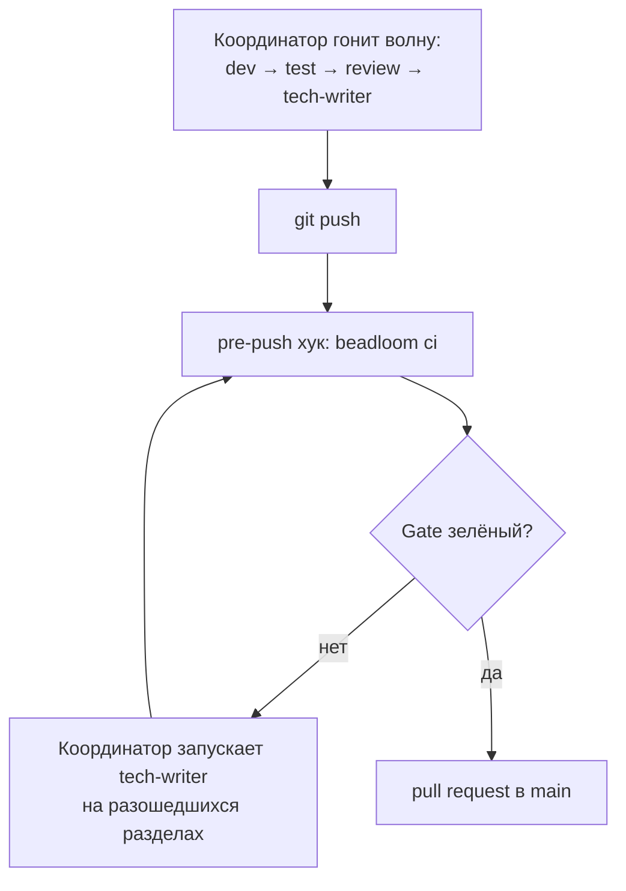
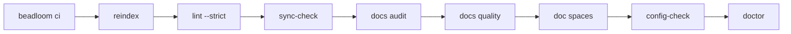
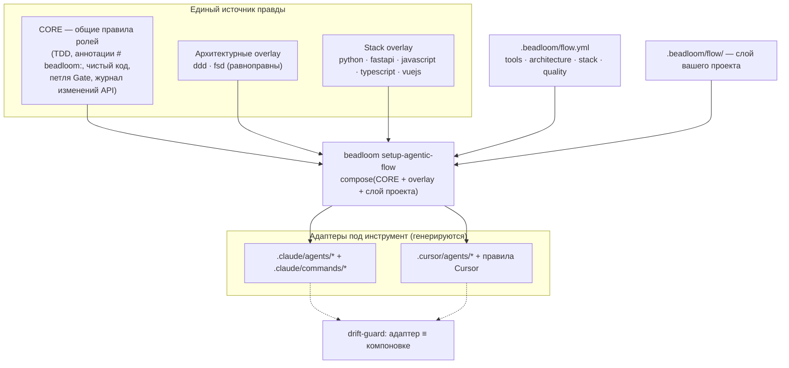
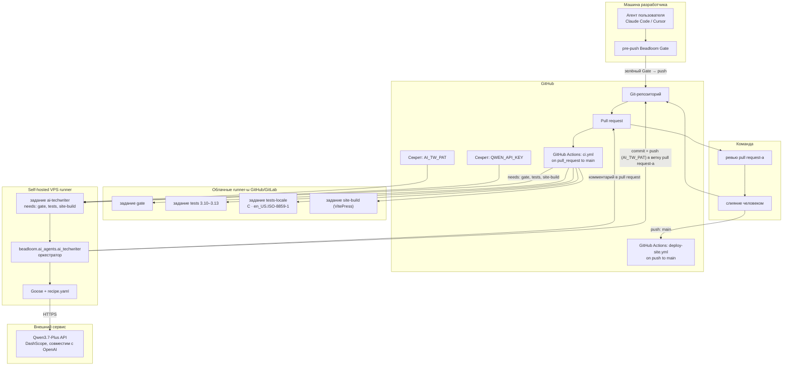
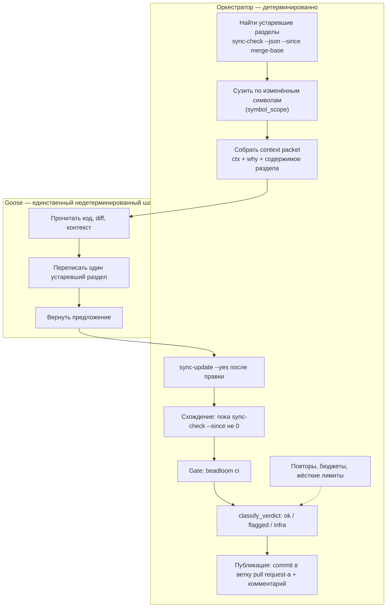
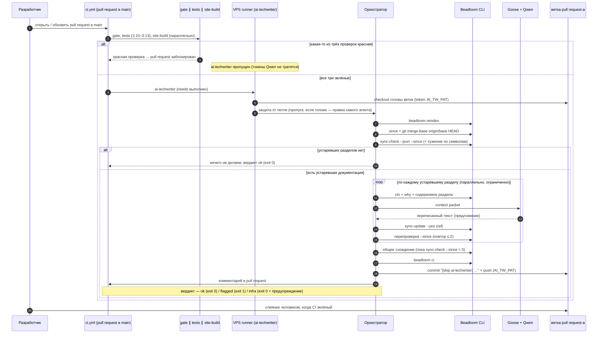

# Агентная разработка в Beadloom: архитектура

> Read this in other languages: [English](./multi-agent-development.md)

> Здесь описано, где что разворачивается, кто за что отвечает и как части системы связаны между собой. Всё сказанное относится к текущему, выпущенному состоянию.

---

## Как мы закрываем разрыв между кодом и доками

Beadloom держит архитектуру и доки в одном графе, чтобы они не разъезжались. Как только код меняется, `sync-check` прямо говорит: этот раздел доков больше не описывает привязанный к нему код. Долгое время на этом всё и заканчивалось. Дальше кому-то нужно было сесть и переписать раздел, а эту задачу, как водится, постоянно откладывали.

Процесс ниже вшивает обновление доков в обычную работу над таской. Правило всего одно: **в `main` не попадает код без актуальной документации.** Держится это правило не на дисциплине, а на exit code. За это отвечает Beadloom Gate, который подключен в двух местах: перед push и в CI. Забыть обновить доки — можно. А вот протащить код мимо Gate — нет.

---

## Основной флоу: документация живёт рядом с кодом

Документацию генерит тот же агент, в котором ты уже кодишь: Claude Code, Cursor или что-то подобное. Весь упакованный пайплайн Beadloom крутится прямо там: сначала `/task-init`, потом `/coordinator`, затем по ролям — dev, test, review, tech-writer, и в конце пуш. Роль tech-writer правит доки прямо в той же ветке, где лежит код. Поднимать на машине вторую LLM не нужно.

Перед каждым пушем срабатывает гит-хук, который настраивается через `beadloom install-hooks`. Он запускает `beadloom ci` целиком.


```mermaid
flowchart TB
  WORK["Координатор гонит волну:<br/>dev → test → review → tech-writer"]
  PUSH["git push"]
  GATE["pre-push хук: beadloom ci"]
  RED{"Gate зелёный?"}
  FIX["Координатор запускает tech-writer<br/>на разошедшихся разделах"]
  PR["pull request в main"]

  WORK --> PUSH --> GATE --> RED
  RED -->|нет| FIX --> GATE
  RED -->|да| PR
```

Если Gate загорелся красным, пуш блокируется. В этом случае координатор снова гоняет роль tech-writer по рассинхронизировавшимся разделам, прогоняет проверку и открывает pull request только когда всё станет зелёным. Количество ретраев жёстко ограничено, чтобы не уйти в бесконечный цикл. Вся эта петля явно прописана в `/coordinator` как последовательность шагов, так что агенту не нужно «держать её в голове».

`pre-commit` оставляем лёгким: только линтинг и быстрый `sync-check`. А вот жёсткий барьер висит на `pre-push`. Аварийный люк работает честно: `git push --no-verify` обойдёт хук, но сам факт обхода будет светиться в истории коммитов. Если в репо вообще нет Beadloom, хук просто ничего не делает и ничего не блокирует.

Держи в голове главный принцип: **весь цикл детерминирован, кроме одного шага — написания самого текста. И этот шаг ограничен Gate-ом и человеческим ревью pull request-а.**

## Gate: восемь шагов и слепые зоны каждого

Пайплайн `beadloom ci` последовательно прогоняет восемь шагов. Если в проекте объявлены репозитории-спутники, девятым шагом идёт `federate`.


```mermaid
flowchart LR
  CI["beadloom ci"] --> R["reindex"]
  R --> L["lint --strict"]
  L --> S["sync-check"]
  S --> DA["docs audit"]
  DA --> DQ["docs quality"]
  DQ --> DS["doc spaces"]
  DS --> C["config-check"]
  C --> D["doctor"]
```

Этот же набор проверок висит в pre-push хуке и отдельным джобом `gate` в CI. Причём три шага из восьми смотрят исключительно в документацию.

| Шаг | Что именно он подтверждает |
|---|---|
| `reindex` | индекс собран на основе графа, документации и кода |
| `lint --strict` | границы архитектуры соблюдены, теневых модулей нет |
| `sync-check` | все ссылки в документации ведут на актуальные символы в коде |
| `docs audit` | числа и версии в тексте совпадают с тем, что реально вычисляет проект |
| `docs quality` | плановые документы написаны по стандарту |
| `doc spaces` | у каждой законченной фичи есть документ с описанием |
| `config-check` | собранные адаптеры ролей не расходятся с графом и конфигом |
| `doctor` | граф целостен |

Если `sync-check = 0`, это доказывает свежесть: документация ссылается ровно на те символы, которые сейчас есть в коде. Но этот ноль никак не гарантирует качество формулировок — за стилистику и смысл по-прежнему отвечает человек на ревью.

### Что каждый шаг не проверяет (и честно об этом говорит)

Это ключевая фича Gate, ради которой он вообще так устроен. Зелёный статус шага, который ничего не проверил, не должен восприниматься как зелёный статус шага, проверившего всё.

| Шаг | Что он дополнительно репортит помимо находок |
|---|---|
| `lint` | сколько правил из запущенных вообще ничего не смогли проверить |
| `docs audit` | три варианта ответа по каждому заявленному факту вместо одного (см. ниже) |
| `docs quality` | типы документов, которые не читает ни одна из проверок |
| `doc spaces` | эпики, не создавшие ни одного узла, и эпики, о которых трекер ничего не знает |
| `sync-check` | связки, которые не с чем сравнивать — они считаются отдельно и в число свежих не попадают |

Ответы `docs audit` стоит разобрать подробнее, потому что просто количество сверенных утверждений само по себе ни о чём не говорит.

| Статус | Что он означает |
|---|---|
| проверено | документ содержит число, и прогон сверил его с тем, что реально вычисляет проект |
| не проверено | сверять было нечего: факт либо не упомянут ни в одном документе, либо его значение не позволяет прочитать из него никакое утверждение |
| неприменимо | проект вообще отказался вычислять этот факт, а причина отказа выведена рядом |

Благодаря этому факт, который выпадает из общего числа, называется по имени. Например, на этом репозитории выводится строка `5 of 9 declared fact(s) verified`, а дальше поимённо перечисляются оставшиеся четыре.

### Асимметрия строгости: почему бездействие правила обрабатывается по-разному

Если у правила перестала работать только **часть**, оно выдаёт варнинг, независимо от того, на каком уровне оно настроено. Это может быть мёртвый шаблон пути, исключение, которое ничего не подавляет, или фильтр узлов, не нашедший ни одного элемента, пока остальные проверки того же правила работают. Всё это — дефект конфига, а не нарушение архитектурных границ. Пайплайн из-за этого краснеть не должен, особенно если апдейт не трогал ни строчки кода.

Совсем другая история, если правило не смогло проверить **ничего** из того, что должно было. В таком случае «нарушений не найдено» и «правило вообще не работало» дают одинаковый зелёный вывод, а повышение уровня severity просто испаряется. Чтобы этого не допустить, `doc-area-coherence` и `graph-summary-facts` репортят о полном отказе от проверки ровно на том уровне, который задал проект. Но цена у них разная. Первое работает на уровне `warn` и не ломает ничей пайплайн. Второе идёт на уровне `error`, поэтому проект, который включил его, но не добавил в граф ни одного числового факта, теперь будет падать. Обходится это одним ключом `severity: warn` в записи того же правила. В [Модель архитектуры](./architecture-model.md) разбираются оба этих правила и упоминается третье, которое пока так не умеет.

---

## Как собирается процесс

Сам процесс никак не привязан к конкретному языку программирования или инструменту. Мы собираем роли из готовых блоков через конфиг, и вся конфигурация умещается в одном файле.

```yaml
# .beadloom/flow.yml
tools:        [claude, cursor]   # адаптеры для одного или обоих
architecture: [ddd]              # ddd | fsd (ровно один)
stack:        [python]           # python, fastapi, javascript, typescript, vuejs
quality:      [clean-code, tdd]
language:     en                 # язык документов процесса
```


```mermaid
flowchart TB
  subgraph CANON["Единый источник правды"]
    CORE["CORE — общие правила ролей<br/>(TDD, аннотации # beadloom:, чистый код,<br/>петля Gate, журнал изменений API)"]
    ARCH["Архитектурные overlay<br/>ddd · fsd (равноправны)"]
    STACK["Stack overlay<br/>python · fastapi · javascript · typescript · vuejs"]
  end

  FLOW[".beadloom/flow.yml<br/>tools · architecture · stack · quality"]
  PROJ[".beadloom/flow/ — слой вашего проекта"]
  COMPOSE["beadloom setup-agentic-flow<br/>compose(CORE + overlay + слой проекта)"]

  subgraph ADAPTERS["Адаптеры под инструмент (генерируются)"]
    CLAUDE[".claude/agents/* + .claude/commands/*"]
    CURSOR[".cursor/agents/* + правила Cursor"]
  end

  GUARD["drift-guard: адаптер ≡ компоновке"]

  CORE --> COMPOSE
  ARCH --> COMPOSE
  STACK --> COMPOSE
  FLOW --> COMPOSE
  PROJ --> COMPOSE
  COMPOSE --> CLAUDE
  COMPOSE --> CURSOR
  CLAUDE -.-> GUARD
  CURSOR -.-> GUARD
```

Вся сборка состоит из четырёх слоёв.

- **CORE** — универсальное ядро для всех ролей. В базовой комплектации здесь TDD, принципы чистого кода, петля Gate и журнал изменений публичного API (нужен ролям review и tech-writer). Ещё сюда входит дисциплина аннотаций: роль dev сама расставляет в коде теги `# beadloom:domain=…`, `feature=…` и `component=…`, чтобы граф оставался честным.
- **Архитектурный overlay** — на выбор **ddd** (Domain-Driven Design, чаще для бэкенда) или **fsd** (Feature-Sliced Design, чаще для фронтенда). Оба варианта равноправны. Оверлей добавляет в роль специфичные правила слоёв и границ, а также свой словарь аннотаций.
- **Stack overlay** — специфика конкретного языка и фреймворка. Подтягивает свои сниппеты кода, а также команды для линтинга, проверки типов и прогона тестов.
- **Слой вашего проекта** (лежит в `.beadloom/flow/`) компонуется последним. Он переживает апдейты, потому что при обновлении меняется именно ядро под ним. Если нужно отменить какое-то правило из ядра, это делается через декларацию с указанием причины и дедлайна. Когда срок выйдет, `config-check` об этом сообщит. Все подробности — в [руководстве по проектным оверлеям](./project-overlays.md).

Команда `beadloom setup-agentic-flow` берёт эти слои и собирает из них протоколы для четырёх ролей, slash-команды и `CLAUDE.md`. За целостностью следит отдельный тест `drift-guard` — он проверяет, что сгенерированные адаптеры в точности соответствуют итоговой компоновке. Отсюда важное практическое правило: никогда не правьте роли руками. Любые ручные изменения просто затрутся при следующей сборке.

Для самого Beadloom конфиг максимально скромный: `tools: [claude]`, `architecture: [ddd]`, `stack: [python]`. Но если вашей команде нужно разрабатывать фронтенд на Vue + TypeScript по Feature-Sliced Design в Cursor, вы получите то же самое ядро плюс нужные оверлеи. Всё это включается буквально одной строкой в `flow.yml`.

По части агентов возможности Cursor сегодня вполне сопоставимы с Claude Code: есть свои субагенты, оркестрация с передачей контекста, фоновые задачи, worktree. Благодаря этому полный процесс — координатор плюс роли — одинаково хорошо работает в обоих инструментах. Если же вы используете инструмент без поддержки субагентов, предусмотрен fallback-режим: тот же самый процесс просто выполняется последовательно, шаг за шагом, согласно описанию из `AGENTS.md`. Корректность от этого не страдает (за неё по-прежнему отвечает Gate), теряется только параллельность.

## Что ещё проверяет процесс, кроме свежести документации

Помимо базового цикла «написал код — написал доки — прошёл Gate», в процесс внедрены ещё пять механизмов. У каждого есть своё подробное руководство, а здесь мы разберём только их суть и место в пайплайне.

### Guard-ы: правила процесса теперь исполняются, а не просто читаются

Guard отвечает на один процессный вопрос о конкретной ситуации. Покрыта ли эта правка заявленной задачей? Не идёт ли работа в обход защищённой ветки? Условие задаётся в блоке `guards:` файла `.beadloom/flow.yml`. Считает его сам Beadloom, а адаптер инструмента не содержит никакой собственной логики.

`beadloom guard <имя>` возвращает `0`, если проверка пропущена или пройдена, `1` — если это предупреждение, и `2` — если это блок. Разница в кодах возврата между запуском из шелла и из хука инструмента сделана намеренно. Если в конфигурации дефект или передана невалидная командная строка, шелл получит `3`, а запуск под `--hook` — `2`. Почему так? Потому что `3` не останавливает вызов инструмента, а guard, который не смог дать ответ, ни в коем случае не должен считаться пройденным.

Команда `beadloom guard --liveness` показывает, какие guard-ы реально срабатывали, а какие просто висят мёртвым грузом. В этом репозитории работают `bead-claimed` и `working-branch`, оба на дефолтном уровне `warn`.

### `beadloom waves`: форма волны выводится из графа

Трекер знает, какая задача блокирует какую. Но какой именно код эти задачи трогают — знает только граф архитектуры. Команда `beadloom waves BEAD [BEAD ...]` решает, какие из указанных задач можно запустить параллельно, исходя из независимости занятых ими узлов на уровне кода. Каждую пару, которую он разводит по разным волнам, он сопровождает причиной из закрытого списка: `blocked_by_bead`, `unresolved_scope`, `shared_node`, `shared_file`, `dependency_edge`, `override_serial`.

Как бы ни легли волны, агенты в любом случае делят между собой четыре вещи: рабочее дерево, pre-commit хук, базу свежести документации и пространство идентификаторов трекера. По каждой из этих четырёх сущностей на этапе планирования выносится вердикт, который может быть `failed`. Если сущность никто не измерял, возвращается `unmeasured` с кодом возврата `1` — это находка, а не молчаливый проход. Код `0` — чисто, `1` — есть находки, `2` — неразрешимый конфликт.

Здесь проверяется предусловие, измеренное до запуска волны. За поведением волны после старта ничто не следит. См. [руководство по параллельным волнам](./parallel-waves.md).

### Три пространства документов

Каждый документ лежит в одном из трёх пространств.

| Пространство | Виды документов | Что с ним делает Gate |
|---|---|---|
| TO-BE | `PRD`, `RFC`, `BRIEF`, `CONTEXT`, `PLAN` | читает по стандарту написания, держит в противовес документу AS-IS |
| AS-IS | `SPEC`, `DOC`, `README` | связывает с кодом через `sync-check` |
| WORKING | `ACTIVE` | освобождает от проверки свежести по явному объявлению |

Имена намеренно не TODO и DONE, потому что здесь ничто не меняет статус. PRD не становится «выполненным». Когда работа завершается, создаётся другой артефакт — документ AS-IS.

Причина в том, что флаг не с чем сверять. `status: done` истинен лишь потому, что кто-то его напечатал, и никакие дальнейшие изменения кода не сделают его ложным. У этого отношения оба конца лежат на диске: эпик зафиксировал намерение, задачи закрыты, а у названного узла до сих пор нет документа, описывающего то, что реально построено. Именно это и проверяет `beadloom docs spaces` — один из шагов `beadloom ci`. См. [руководство по видам документов](./document-kinds.md).

### `beadloom review-brief`: ревьюер получает изменение вместе со спецификацией

Команда собирает задание, заявленный скоуп, спецификационные документы графа, связанные сценарии `@bead:` и все изменённые файлы. При этом она придерживает комментарии самой задачи и сообщает, сколько именно комментариев она придержала. Отчёт автора никуда не пропадает: флаг `--release` напечатает его, как только будет записан комментарий с вердиктом.

Смысл именно в таком порядке. Агент, который сначала прочитает вывод автора, склонен проверять сам этот вывод, а не реальные изменения в коде.

### Собственные метаданные графа проверяются против проекта

Ещё недавно все правила читали только связи графа: какой модуль тянется к какому узлу, какому слою разрешено импортировать какой. Поля, которые граф хранит о самом себе, были не нужны никому. В итоге два из них были некорректны на протяжении трёх мажорных релизов, и ни разу не загорелось красным.

`graph-summary-facts` вычитывает числовые и версионные утверждения из `summary` каждого узла и сверяет их с теми же фактами, которые проект вычисляет о себе самостоятельно. Цена ошибки в `summary` высока: эту фразу цитируют `ctx`, `prime`, сгенерированный сайт и каждый адаптер агента.

`doc-area-coherence` проверяет, документирует ли узел сам себя там, где этого требует собственное соглашение графа. Соглашение выводится из проверяемого графа, а не из раскладки, записанной где-то ещё. Поэтому правило работает как на проекте с нарезкой по фичам, так и на нашей раскладке «пакет на домен».

Оба правила — это обычные записи в `.beadloom/_graph/rules.yml`. Оба выводят `unverifiable` отдельным ответом: если в `summary` графа нет ни одного числа или его документы не сходятся ни по одному соглашению, система скажет, что проверка была пропущена, а не что она пройдена и всё чисто. См. [модель архитектуры](./architecture-model.md).

### Рядом: федерация между репозиториями

Команды `beadloom export` и `beadloom federate` переносят тот же вопрос «намерение против реальности» на несколько репозиториев. Каждый сервис публикует детерминированный артефакт с привязкой к коммиту, а хаб собирает два и более таких артефакта в федеративный граф с вердиктами по связям и контрактам. Это не относится к однорепозиторному циклу выше: `beadloom ci` запускает `federate` только в том случае, если проект явно объявляет свои спутники.

## Как Beadloom применяет эти правила к себе

Beadloom строго следует описанным выше принципам в собственном коде. На практике это выражается в четырёх вещах:

- В графе появился тип узла **component** — внутренний строительный блок, который находится рядом с `feature`. Мы включили проверку **module-coverage** в режиме ошибки: каждый модуль в `src/` обязан быть либо узлом графа, либо явно прописанным исключением. Если появляется новый неучтённый модуль, `beadloom ci` падает.
- Серверный AI tech-writer теперь выделен в отдельный домен `ai_agents` внутри пакета со своими чёткими границами импорта.
- Узел обязан документировать себя, если граф требует описания для узлов из его области исходников. Кроме того, в его `summary` нет чисел, которым противоречит проект.
- Если узлу документация действительно не нужна, это решение вместе с причиной фиксируется прямо в графе, а `doctor` выводит эту причину. Осознанное отсутствие документации больше не читается так же, как обычное отсутствие, которое никто не разбирал.

В итоге Beadloom становится первым и самым строгим потребителем собственного процесса. Правило «нет кода без документации» в полной мере работает и для его собственного кода.

## Trunk-based и защита main

Ветка `main` — это наша точка интеграции и защищённая ветка. Пушить напрямую нельзя, весь код едет через pull request. Под каждую задачу заводится короткоживущая ветка `features/<KEY>`, из которой создаётся ровно один PR в `main`. Слияние происходит только после прохождения всех зелёных проверок.

Настройки защиты применяются скриптом `onboarding/branch_protection.py`. По умолчанию используется `DEFAULT_STATUS_CHECK_CONTEXTS` — набор из девяти проверок из консолидированного `ci.yml`. Этот набор подхватывается любым проектом, развёрнутым по нашему шаблону:

```
gate · tests (3.10) · tests (3.11) · tests (3.12) · tests (3.13) ·
tests-locale (C) · tests-locale (en_US.ISO-8859-1) ·
site-build · ai-techwriter
```

В этом конкретном репозитории защита требует только семь из них. Двух контекстов `tests-locale` в ней нет (это проверено запросом `gh api repos/:owner/:repo/branches/main/protection`). Обе проверки локали изначально были красными, пока мы не починили баг в текстовом вводе-выводе, который они и поймали. Сейчас они зелёные. Суть этих проверок не в самом факте прохождения, а в запуске одного и того же набора тестов в другом окружении — нам важна именно разница между окружениями, а не цвет каждого из них.

Если обязательная проверка упадёт, а стоит флаг `strict: true`, слить PR в `main` будет невозможно. Команда `beadloom setup-branch-protection` идемпотентна, но перезапускать её имеет смысл только после того, как вы сверили заявленные контексты с теми, что реально становятся зелёными в открытом PR. Альтернативный вариант — передать `--check` с тем набором, который конвейер физически может выполнить.

Количество заявленных контекстов менялось в обе стороны, и этот кейс стоит запомнить. Десятым пунктом мы добавили `tests-windows`, чтобы варьировать платформу так же, как `tests-locale` варьирует окружение. Но потом владелец его убрал. Причина чисто прагматичная: 16–28 минут runner-времени на каждый PR. В отличие от локали, эта проверка становилась критическим путём и увеличивала время от создания PR до мёрджа примерно втрое. При этом Windows не входит в целевые платформы проекта. Здесь никогда ничего под Windows не запускалось и, по нашему решению, не будет. Этот факт зафиксирован в `docs/domains/application/features/flow-guards/SPEC.md` в разделе *Windows: unverified by decision*, чтобы зелёный конвейер ложно не намекал на поддержку этой ОС.

Флаг `enforce_admins: true` означает, что даже владелец репы интегрирует свой код исключительно через pull request. При этом ноль обязательных ревью оставляет одиночному мейнтейнеру возможность самому нажать кнопку merge, но обойти защиту `main` он всё равно не сможет.

И ещё одна важная тонкость GitHub. Если обязательная проверка пропущена, он считает её нейтральной, то есть пройденной. Из-за этого, если падают `gate`, `tests` или `site-build`, задание `ai-techwriter` просто пропускается, и PR блокируется именно красными основными проверками. Но как только верхние три становятся зелёными, `ai-techwriter` запускается по-настоящему, и его вердикт становится финальным барьером.

## Физическая топология: где что работает

Частый вопрос: вся эта магия крутится в облаке GitHub/GitLab или на нашем железе?


```mermaid
flowchart TB
  subgraph LOCAL["Машина разработчика"]
    AGENT["Агент пользователя<br/>Claude Code / Cursor"]
    PREPUSH["pre-push Beadloom Gate"]
  end

  subgraph GITHUB["GitHub"]
    GH_REPO["Git-репозиторий"]
    GH_SECRET["Секрет: QWEN_API_KEY"]
    GH_PAT["Секрет: AI_TW_PAT"]
    GH_CI["GitHub Actions: ci.yml<br/>on pull_request to main"]
    GH_DEPLOY["GitHub Actions: deploy-site.yml<br/>on push to main"]
    GH_PR["Pull request"]
  end

  subgraph CLOUD_RUN["Облачные runner-ы GitHub/GitLab"]
    JOB_GATE["задание gate"]
    JOB_TESTS["задание tests 3.10–3.13"]
    JOB_LOCALE["задание tests-locale<br/>C · en_US.ISO-8859-1"]
    JOB_SITE["задание site-build (VitePress)"]
  end

  subgraph VPS["Self-hosted VPS runner"]
    AITW["задание ai-techwriter<br/>needs: gate, tests, site-build"]
    ORCH["beadloom.ai_agents.ai_techwriter<br/>оркестратор"]
    GOOSE_RT["Goose + recipe.yaml"]
  end

  subgraph EXTERNAL["Внешний сервис"]
    QWEN["Qwen3.7-Plus API<br/>DashScope, совместим с OpenAI"]
  end

  subgraph DEV["Команда"]
    REVIEW["ревью pull request-а"]
    MERGE["слияние человеком"]
  end

  AGENT --> PREPUSH
  PREPUSH -->|"зелёный Gate → push"| GH_REPO
  GH_REPO --> GH_PR --> GH_CI
  GH_CI --> JOB_GATE
  GH_CI --> JOB_TESTS
  GH_CI --> JOB_LOCALE
  GH_CI --> JOB_SITE
  GH_CI -->|"needs: gate, tests, site-build"| AITW
  GH_SECRET --> AITW
  GH_PAT --> AITW
  AITW --> ORCH --> GOOSE_RT
  GOOSE_RT -->|HTTPS| QWEN
  ORCH -->|"commit + push (AI_TW_PAT) в ветку pull request-а"| GH_REPO
  ORCH -->|"комментарий в pull request"| GH_PR
  GH_PR --> REVIEW --> MERGE --> GH_REPO
  MERGE -->|"push: main"| GH_DEPLOY
```

**Локально.** Здесь живёт основной слой: агент разработчика и pre-push Gate. В облако улетает уже согласованная пара — код и документация вместе.

**Облако GitHub/GitLab.** Здесь хранятся код, каталоги `docs/**` и `.beadloom/`, конфиги пайплайна и открытые pull request-ы. Единый `ci.yml` триггерится на каждый pull request в `main`. На облачных runner-ах параллельно взлетают джобы `gate`, `tests` (матрица Python 3.10–3.13), `tests-locale` (полный прогон тестов в локалях `C` и `en_US.ISO-8859-1`) и `site-build`.

Джоба `ai-techwriter` настроена через `needs: [gate, tests, site-build]`. Она стартует только после того, как эти три джобы упадут в зелёный, — так мы не сливаем токены Qwen на сломанные pull request-ы.

`tests-locale` в этот `needs:` намеренно не добавили. Эта джоба просто проверяет среду выполнения тестов и не накладывает требований на работу агента, но при этом блокирует мёрж через branch protection.

Отдельный `deploy-site.yml` — это единственная джоба, которая триггерится на `push: main`. Она деплоит сайт на GitHub Pages. Поскольку мы сидим на строгом trunk-based, ветка `main` по определению всегда зелёная.

**Self-hosted VPS runner.** Единственное место, где в одном флаконе живут Goose, оркестратор и доступ к API-ключу модели. Версии `uv`, Python, Beadloom CLI и Goose на нём жёстко зафиксированы, а каждый прогон стартует с чистого checkout.

**Qwen3.7-Plus.** Работает как облачный API, локально на сервере никаких моделей не крутится.

**Beadloom CLI.** Ставится прямо на runner, но его исходники лежат в `src/beadloom/` вместе с остальным репозиторием. Это полноценная часть продукта, пайплайн его не генерирует.

## Резервный путь: серверный AI tech-writer

Пока локальный Gate работает, резервный путь простаивает. Он срабатывает, если pull request всё же приходит без актуальной документации: от внешнего участника или от того, кто обошёл основной процесс. Логика одинакова для GitHub Actions и GitLab CI и отличается лишь триггером, именами секретов и способом публикации правок.

В процессе задействованы три участника с намеренно разными ролями.

| Участник | Где находится | Что делает |
|---|---|---|
| **Оркестратор** | `src/beadloom/ai_agents/ai_techwriter/` | Детерминированный цикл: поиск устаревших разделов, исправление, сходимость к нулю, Gate, вердикт, публикация |
| **Goose** | self-hosted runner, recipe (`recipe.yaml`) поставляется в пакете `beadloom` | Читает контекст и переписывает по одному разделу документации за раз |
| **Qwen3.7-Plus** | внешний API (DashScope, совместимый с OpenAI) | Модель `qwen3.7-plus`. Ключ хранится только в секрете CI |

Beadloom предоставляет команды. Оркестратор собирает из них цикл. Goose пишет текст, причём строго в тех границах, которые задал оркестратор.

Оркестратор — стандартный компонент пакета: у него есть узел графа, работа с символами, проверка `sync-check` и архитектурные границы. Он вызывается как `python -m beadloom.ai_agents.ai_techwriter`. Копировать исходники в сторонний репозиторий не нужно, они приходят вместе с пакетом.

Важный принцип: цикл «исправление → сходимость → вердикт → публикация» не попадает в ядро Beadloom. В `src/beadloom/` лежат только отдельные команды: `sync-check --since`, неинтерактивный `sync-update --yes`, `ci`, `ctx`, `why`, защита ветки, семейство `setup-*` и конфигуратор ролей. Один и тот же код оркестратора вызывается как из GitHub Actions, так и из GitLab CI; отличаются только триггер, имена секретов и флаг `--platform`.

### Что делает оркестратор и что достаётся Goose

Всю механическую работу берёт на себя оркестратор. Агенту достаётся единственный шаг, требующий принятия решений.


```mermaid
flowchart TB
  subgraph DETERMINISTIC["Оркестратор — детерминированно"]
    D1["Найти устаревшие разделы<br/>sync-check --json --since merge-base"]
    D1b["Сузить по изменённым символам<br/>(symbol_scope)"]
    D2["Собрать context packet<br/>ctx + why + содержимое раздела"]
    D3["sync-update --yes после правки"]
    D4["Схождение: пока sync-check --since не 0"]
    D5["Gate: beadloom ci"]
    D6["classify_verdict: ok / flagged / infra"]
    D7["Публикация: commit в ветку pull request-а + комментарий"]
    D8["Повторы, бюджеты, жёсткие лимиты"]
  end

  subgraph NONDET["Goose — единственный недетерминированный шаг"]
    N1["Прочитать код, diff, контекст"]
    N2["Переписать один устаревший раздел"]
    N3["Вернуть предложение"]
  end

  D1 --> D1b --> D2 --> N1
  N1 --> N2 --> N3
  N3 --> D3 --> D4 --> D5 --> D6 --> D7
  D8 -.-> D6
```

Набор инструментов Goose строго ограничен, и это элемент безопасности. Даже в случае ошибки агента радиус поражения остаётся минимальным.

| Разрешено | Запрещено |
|---|---|
| чтение файловой системы: код, diff | запись в `src/` |
| чтение через Beadloom: `ctx`, `why`, `search`, `sync-check` | произвольные команды оболочки |
| чтение через git: `diff`, `log`, `show` | произвольная сеть |
| запись только в `docs/**` | `sync-update` и слияние |
| сеть только до endpoint-а модели | выбор области исправления |

Благодаря этому цикл остаётся воспроизводимым, а Goose можно заменить другим агентным инструментом без изменений в ядре Beadloom.

### Прогон шаг за шагом


```mermaid
sequenceDiagram
  autonumber
  participant Dev as Разработчик
  participant CI as ci.yml (pull request в main)
  participant V as gate ∥ tests ∥ site-build
  participant R as VPS runner (ai-techwriter)
  participant O as Оркестратор
  participant BL as Beadloom CLI
  participant G as Goose + Qwen
  participant Repo as ветка pull request-а

  Dev->>CI: открыть / обновить pull request в main
  CI->>V: gate, tests (3.10–3.13), site-build (параллельно)

  alt какая-то из трёх проверок красная
    V-->>CI: красная проверка → pull request заблокирован
    Note over R: ai-techwriter пропущен (токены Qwen не тратятся)
  else все три зелёные
    CI->>R: ai-techwriter (needs выполнен)
    R->>Repo: checkout головы ветки (token: AI_TW_PAT)
    R->>O: защита от петли (пропуск, если голова — правка самого агента)
    O->>BL: beadloom reindex
    O->>BL: since = git merge-base origin/base HEAD
    O->>BL: sync-check --json --since (+ сужение по символам)

    alt устаревших разделов нет
      O-->>CI: ничего не делаем, вердикт ok (exit 0)
    else есть устаревшая документация
      loop по каждому устаревшему разделу (параллельно, ограниченно)
        O->>BL: ctx + why + содержимое раздела
        O->>G: context packet
        G-->>O: переписанный текст (предложение)
        O->>BL: sync-update --yes (ref)
        O->>BL: перепроверка --since (повтор ≤ 2)
      end
      O->>BL: общее схождение (пока sync-check --since = 0)
      O->>BL: beadloom ci
      O->>Repo: commit "[skip ai-techwriter] …" + push (AI_TW_PAT)
      O->>CI: комментарий в pull request
      Note over O,CI: вердикт — ok (exit 0) / flagged (exit 1) / infra (exit 0 + предупреждение)
    end
  end

  Dev->>Repo: слияние человеком, когда CI зелёный
```

Первое, что делает задание, — **защита от зацикливания**. Если голова ветки — это коммит самого агента (автор `beadloom-ai-techwriter` или сообщение содержит `[skip ai-techwriter]`), задание пропускается, чтобы push агента не запускал повторный прогон. Иначе выполняются `reindex`, вычисление базовой точки `since = git merge-base origin/base HEAD` и `sync-check --json --since`.

**Сужение по символам.** Раньше изменение одного объёмного файла помечало устаревшими все связанные с ним разделы, и правка одной строки в `cli.py` тянула за собой полтора десятка разделов. Теперь оркестратор анализирует, какие символы реально изменились в файле, и сверяет их с теми, на которые ссылается раздел документации. Раздел, не зависящий ни от одного изменившегося символа, исключается из работы и молча помечается как актуальный, чтобы `sync-check` сошёлся к нулю без переписывания. Правило осторожное: при любой неоднозначности раздел остаётся в работе. Лучше переписать лишнее, чем пропустить нужное. Удалённое или переименованное имя также оставляет раздел в работе.

**При наличии расхождений.** Оркестратор обходит устаревшие разделы ограниченным пулом параллельных сессий (по умолчанию три). При ответах 429 и 5xx включается экспоненциальная задержка, чтобы не упереться в лимиты тарифа. Для каждого раздела собирается context packet, Goose переписывает текст, после чего оркестратор вызывает `sync-update --yes` и выполняет повторную проверку через `--since`.

После обработки всех разделов выполняется **общая сходимость**: `sync-check --since` и проверка актуальности повторяются для новых разошедшихся пар, пока не установится устойчивый ноль. Правка одного доменного раздела может затронуть соседние пары, и это известно с самой первой версии оркестратора. В конце выполняются `beadloom ci`, коммит правки прямо в ветку pull request-а и комментарий в pull request. У коммита сообщение `[skip ai-techwriter] …` и автор `beadloom-ai-techwriter`, а push выполняется через `AI_TW_PAT`, чтобы коммит запускал проверку `gate`.

### Вердикт: ok, flagged, infra

`ai-techwriter` — обязательная проверка, которая завершается ошибкой только при реальной нерешённой проблеме с документацией. Сбой инфраструктуры не приводит к ошибке. Прогон классифицирует результат через `runner.py::classify_verdict`, а `cli.py` транслирует вердикт в код возврата. Отличить проблему документации от сбоя инфраструктуры просто: достаточно проверить, выдала ли модель хоть какой-то вывод (`input_tokens + output_tokens > 0`).

| Вердикт | Условие | Код возврата | Эффект |
|---------|-------|--------------|--------|
| **ok** | устаревших разделов нет, либо правка прошла успешно | `0` | проверка зелёная |
| **flagged** | модель работала (`tokens > 0`), но документация всё ещё расходится с кодом: после правки `beadloom ci` красный, сходимость не достигнута или превышен бюджет | `1` | проверка красная, pull request заблокирован, требуется вмешательство человека |
| **infra** | модель не выдала ни одного токена (`tokens == 0`): мёртвый self-hosted runner, ответ 5xx или таймаут провайдера, исчерпана квота | `0` | проверка зелёная, выводится явный `::warning::` и, по возможности, добавляется комментарий в pull request |

Вывод прост: мёртвый VPS или исчерпанная квота тарифа не блокируют слияние. Настоящее нерешённое расхождение документации с кодом — блокирует. Классификация намеренно осторожна, и ноль токенов всегда трактуется как `infra`. Даже ошибочный `infra` не теряется: он подсвечивается предупреждением в CI, чтобы человек мог перезапустить прогон.

## Синхронизация трекера и ACTIVE.md

С трекингом задач та же беда, что и с документацией: статусы велись сразу в двух местах — в трекере `bd` и в таблице внутри `ACTIVE.md`. Поскольку оба места поддерживались вручную, они быстро рассинхронизировались и переставали отражать реальность.

Команда `beadloom active-sync` решает эту проблему, считая `bd` единственным источником истины. Она парсит идентификаторы задач из таблицы в `ACTIVE.md`, запрашивает их актуальные статусы из `bd` и обновляет только соответствующие ячейки. Заголовки, описания и лог прогресса команда не трогает, сохраняя при этом все осмысленные заметки мейнтейнера. Заодно `beadloom active-sync` экспортирует состояние трекера в отслеживаемый файл `.beads/issues.jsonl` — благодаря этому факты закрытия задач не теряются при мёрдже веток.

Вся эта механика зашита в pre-commit хук как автофикс, поэтому закоммитить устаревшую таблицу статусов просто невозможно. Если в репозитории нет трекера или отсутствуют файлы `ACTIVE.md`, команда ничего не делает.

## Архитектурные ограничения

*   **Оркестрация остаётся в клиенте.** Сервер MCP отдаёт 18 инструментов, и только четыре из них ведут процесс: `task_init`, `bead_context`, `complete_bead`, `checkpoint`. Сам MCP не умеет плодить субагентов или крутить main loop, поэтому координатор и волны субагентов живут внутри агента пользователя. Конфигуратор только собирает под них роли, а инструменты MCP — это детерминированные шаги, которые процесс вызывает по ходу дела.
*   **`complete_bead` — сильная рекомендация.** Модель сама решает, когда его дёрнуть. Это строже текстовых инструкций и реально не даёт закрыть задачу при красном Gate, но источником истины остаётся CI.
*   **Заставляет только Gate.** Он стоит на двух рубежах: локально это pre-push хук, на сервере — обязательные проверки `ci.yml`. Оба гоняют один и тот же `beadloom ci`. Обойти их можно только осознанным `--no-verify`, который всё равно виден в истории.
*   **Переход на `ty` отложен.** Быстрый чекер типов `ty` от Astral пока в бете и по точности уступает `mypy`. Проект остаётся на `mypy --strict` и вернётся к вопросу, когда у `ty` выйдет стабильный релиз.

## Безопасность и контроль изменений

Ключ `QWEN_API_KEY` и токен `AI_TW_PAT` хранятся в секретах CI (GitHub Secrets или переменные GitLab CI/CD) и доступны только джобам на self-hosted runner. В репозиторий и логи они не попадают. Сам раннер привязан к проекту, а под каждый прогон поднимается изолированное временное workspace.

Автоматического мержа нет. `sync-check = 0` гарантирует только свежесть, но не качество текста, поэтому pull request мержит человек.

Отдельный нюанс: запуск `sync-update` вне цикла. Технически это тот же интерактивный `sync-update`, которым можно случайно «озеленить» кривой раздел. Именно поэтому ревью pull request и обоснование в его описании — обязательная часть процесса.

## Шпаргалка: как устроен пайплайн документации

| Вопрос | Ответ |
|--------|-------|
| Кто пишет документацию в базовом сценарии? | Dev-агент (Claude Code, Cursor) локально, прямо рядом с кодом |
| Что не пропустит код без документации? | Beadloom Gate: локальный pre-push хук плюс обязательная проверка в CI |
| Что внутри Gate? | `reindex`, `lint --strict`, `sync-check`, `docs audit`, `docs quality`, `doc spaces`, `config-check`, `doctor`. Девятым идёт `federate`, если объявлены спутники |
| Зачем тогда серверный ai-techwriter? | Это фоллбэк: включается, если pull request пришёл без свежей документации |
| Где крутится gate / tests / site-build? | На облачных runner-ах GitHub или GitLab |
| Где крутится ai-techwriter? | На self-hosted runner-е в VPS (Goose плюс ключ модели) |
| Где живёт оркестратор? | В `src/beadloom/ai_agents/ai_techwriter/` — это домен пакета |
| Как он запускается? | `python -m beadloom.ai_agents.ai_techwriter` |
| Чем настраивается процесс? | Через `.beadloom/flow.yml`: tools (claude/cursor) · architecture (ddd/fsd) · stack · quality · guards |
| Триггер CI | `on: pull_request → main`, всё собирается в единый `ci.yml`. На `push: main` работает только `deploy-site.yml` |
| Порядок заданий | `gate ∥ tests ∥ tests-locale ∥ site-build` параллелятся, следом идёт `ai-techwriter` (`needs: [gate, tests, site-build]`) |
| От чего считается расхождение? | От `git merge-base origin/<base> HEAD` (флаг `--since`), область диффа сужается по реально изменённым символам |
| Куда кладётся правка? | Коммит в ветку того же pull request-а, пуш через `AI_TW_PAT` |
| Вердикт | Статусы `ok` и `infra` дают exit 0, `flagged` даёт exit 1 |
| Обязательные проверки | По умолчанию их девять, в этом репозитории живут семь, без двух контекстов `tests-locale` |
| Защита ветки | `enforce_admins: true`, ноль обязательных ревью |
| Как попадает в main? | Только через pull request и ручное слияние, автоматического слияния нет |
| Что пишет серверный агент? | Исключительно `docs/**` |

## Сопутствующая документация и RFC

| Документ | Описание |
|---|---|
| [`agentic-flow.md`](./agentic-flow.md) | Упакованный процесс и конфигуратор ролей |
| [`ai-techwriter.md`](./ai-techwriter.md) | Мануал для оператора по серверному AI tech-writer |
| [`parallel-waves.md`](./parallel-waves.md) | Гарантии волны параллельных агентов и изоляция ревьюера |
| [`document-kinds.md`](./document-kinds.md) | Три пространства документов и стандарт написания |
| [`project-overlays.md`](./project-overlays.md) | Четыре слоя сборки и проектный оверлей, который переживает обновления |
| [`architecture-model.md`](./architecture-model.md) | Домен, фича и компонент; проверка без теневого кода; два правила для метаданных графа |

Историю решений мы храним в виде RFC внутри `.claude/development/docs/features/`. Вот основные:

* BDL-047 — первая архитектура оркестратора
* BDL-049 — переход на trunk-based
* BDL-050 — консолидация CI и система вердиктов
* BDL-051 — Beadloom управляет сам собой
* BDL-052 — настраиваемый процесс и pre-push Gate
* BDL-053 — когерентность трекера и `ACTIVE.md`
* BDL-061 — guard-ы, слой проекта, три пространства документов, волны и `review-brief`
* BDL-062 — метаданные графа как проверяемая поверхность
