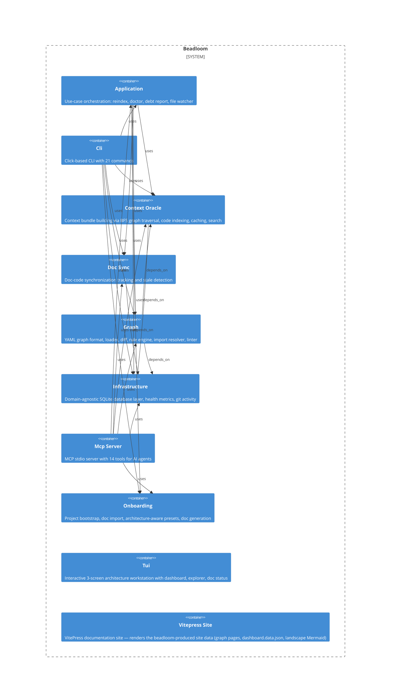

# Architecture overview

Generated by `beadloom docs site` — Beadloom produces, VitePress renders.

## At a glance

- 6 domains, 4 services, 14 features

## Health

- 25 nodes, 76 edges, 28 docs — coverage 96%, 0 stale

## Top-level diagram

