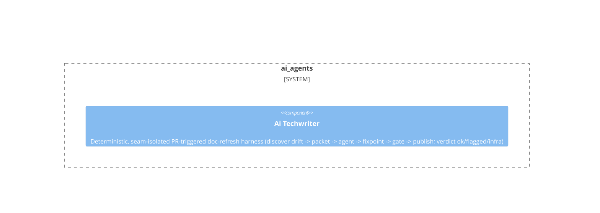

# ai_agents

**Kind:** domain

Governed AI-agent harnesses (Goose + model) over Beadloom read APIs + bd/beadloom shells; ships in the package

**Source:** `src/beadloom/ai_agents/`

## Public symbols

- `AgentResult`
- `AgentRunner`
- `CommandResult`
- `CommentPublisher`
- `ContextPacket`
- `DriftItem`
- `FakeAgentRunner`
- `FakePublisher`
- `GateResult`
- `GitHubPRBranchPublisher`
- `GitHubPublisher`
- `GitLabPRBranchPublisher`
- `GitLabPublisher`
- `GooseAgentRunner`
- `HarnessConfig`
- `HarnessResult`
- `ProviderConfig`
- `PublishResult`
- `RateLimitError`
- `ReviewPublisher`
- `RunRecord`
- `append_run`
- `backoff_delay`
- `beadloom_ci`
- `beadloom_ctx_json`
- `beadloom_docs_polish_json`
- `beadloom_sync_check_json`
- `beadloom_sync_update`
- `beadloom_why`
- `build_packet`
- `changed_symbols`
- `classify_verdict`
- `default_recipe_path`
- `discover_scope`
- `doc_referenced_symbols`
- `git_changed_line_numbers`
- `git_changed_line_numbers_old_side`
- `git_file_at_ref`
- `load_runs`
- `main`
- `narrow_by_changed_symbols`
- `parse_scope`
- `python_symbol_ranges`
- `qwen_provider`
- `read_doc`
- `read_working_file`
- `retry_with_backoff`
- `run_command`
- `run_harness`
- `runs_store_path`
- `select_polish_for_ref`

## Relationships

- **part_of**: [beadloom](../services/beadloom.md)
- **Parts**: [ai-techwriter](../features/ai-techwriter.md)

## Documentation

- [domains/ai_agents/README.md](/docs/domains/ai_agents/README.md)

## Diagram

