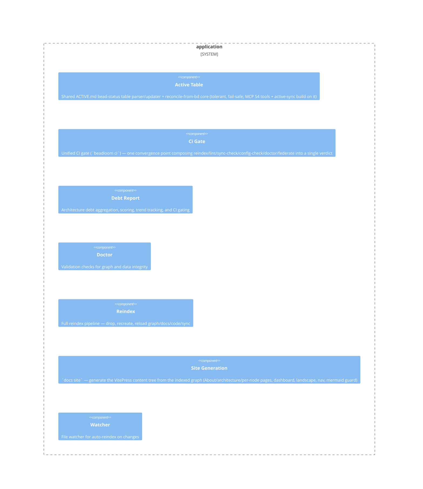

# application

**Kind:** domain

Use-case orchestration: reindex, doctor, debt report, file watcher

**Source:** `src/beadloom/application/`

## Public symbols

- `CategoryScore`
- `Check`
- `DebtData`
- `DebtReport`
- `DebtTrend`
- `DebtWeights`
- `GateResult`
- `GateStep`
- `MermaidIssue`
- `MermaidValidationError`
- `MetricsPoint`
- `NodeDebt`
- `NodePage`
- `NodeRow`
- `PublishedDoc`
- `ReconcileResult`
- `ReindexResult`
- `Severity`
- `SiteResult`
- `WatchEvent`
- `append_metrics_point`
- `backfill_structural_history`
- `bd_status_to_cell`
- `build_dashboard_data`
- `build_landscape_data`
- `build_published_docs`
- `collect_debt_data`
- `compute_debt_score`
- `compute_debt_trend`
- `compute_top_offenders`
- `existing_page_urls`
- `format_debt_json`
- `format_debt_report`
- `format_top_offenders_json`
- `format_trend_section`
- `generate_site`
- `history_path`
- `human_label`
- `incremental_reindex`
- `inject_badge`
- `is_separator_cells`
- `load_debt_weights`
- `load_nodes`
- `publish_docs`
- `read_history`
- `reconcile_active_tables`
- `reindex`
- `render_about`
- `render_all_pages`
- `render_architecture_group`
- `render_dashboard_md`
- `render_documentation_group`
- `render_documentation_group_from_dir`
- `render_landscape_md`
- `render_nav`
- `render_nav_config`
- `render_node_page`
- `render_published_doc`
- `render_sidebar`
- `resolve_scan_paths`
- `run_checks`
- `run_ci_gate`
- `serialize_dashboard_data`
- `set_active_table_status`
- `split_table_row`
- `validate_mermaid`
- `watch`

## Relationships

- **part_of**: [beadloom](../services/beadloom.md)
- **depends_on**: [context-oracle](../domains/context-oracle.md), [doc-sync](../domains/doc-sync.md), [graph](../domains/graph.md), [infrastructure](../domains/infrastructure.md)
- **uses**: [context-oracle](../domains/context-oracle.md), [doc-sync](../domains/doc-sync.md), [graph](../domains/graph.md), [infrastructure](../domains/infrastructure.md), [onboarding](../domains/onboarding.md)
- **Used by**: [beadloom](../services/beadloom.md), [cli](../services/cli.md), [mcp-server](../services/mcp-server.md)
- **Parts**: [active-table](../other/active-table.md), [ci-gate](../features/ci-gate.md), [debt-report](../features/debt-report.md), [doctor](../features/doctor.md), [reindex](../features/reindex.md), [site-generation](../features/site-generation.md), [watcher](../features/watcher.md)

## Documentation

- [domains/application/README.md](/docs/domains/application/README.md)

## Diagram

