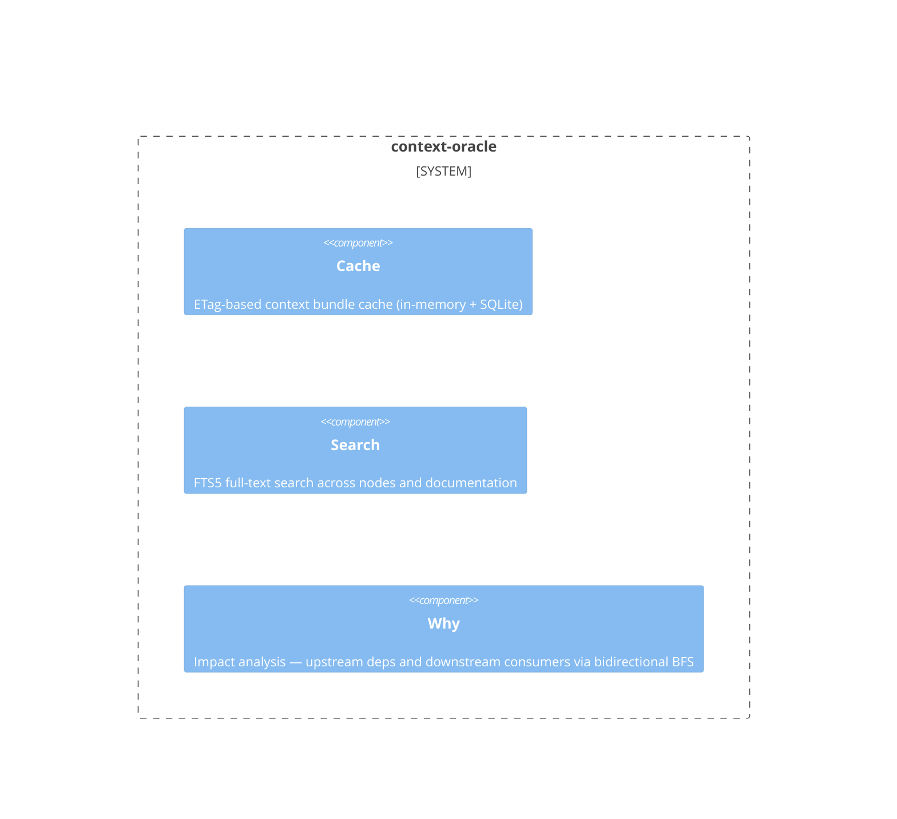

# context-oracle

**Kind:** domain

Context bundle building via BFS graph traversal, code indexing, caching, search

**Source:** `src/beadloom/context_oracle/`

## Public symbols

- `CacheEntry`
- `ContextCache`
- `ImpactSummary`
- `LangConfig`
- `NodeInfo`
- `Route`
- `SqliteCache`
- `TestMapping`
- `TreeNode`
- `WhyResult`
- `aggregate_parent_tests`
- `analyze_node`
- `bfs_subgraph`
- `build_context`
- `check_parser_availability`
- `clear_cache`
- `collect_chunks`
- `compute_etag`
- `estimate_tokens`
- `extract_routes`
- `extract_symbols`
- `format_routes_for_display`
- `get_lang_config`
- `has_fts5`
- `map_tests`
- `parse_annotations`
- `populate_search_index`
- `render_why`
- `render_why_tree`
- `result_to_dict`
- `search_fts5`
- `suggest_ref_id`
- `supported_extensions`

## Relationships

- **part_of**: [beadloom](../services/beadloom.md)
- **depends_on**: [infrastructure](../domains/infrastructure.md)
- **Used by**: [application](../domains/application.md), [beadloom](../services/beadloom.md), [cli](../services/cli.md), [graph](../domains/graph.md), [mcp-server](../services/mcp-server.md), [reindex](../features/reindex.md)
- **Parts**: [cache](../features/cache.md), [search](../features/search.md), [why](../features/why.md)

## Documentation

- [domains/context-oracle/README.md](/docs/domains/context-oracle/README.md)

## Diagram

