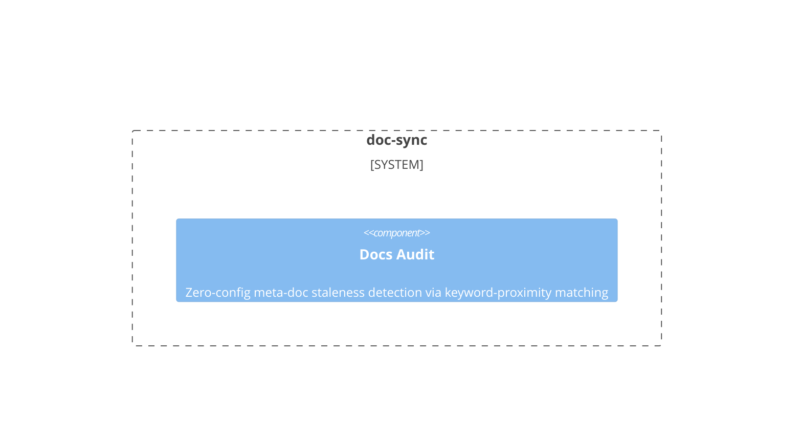

# doc-sync

**Kind:** domain

Doc-code synchronization tracking and stale detection

**Source:** `src/beadloom/doc_sync/`

## Public symbols

- `AuditFinding`
- `AuditResult`
- `DocIndexResult`
- `DocScanner`
- `Fact`
- `FactRegistry`
- `Mention`
- `SyncPair`
- `build_sync_state`
- `check_doc_coverage`
- `check_source_coverage`
- `check_sync`
- `check_sync_since`
- `chunk_markdown`
- `classify_section`
- `compare_facts`
- `index_docs`
- `mark_synced`
- `mark_synced_by_ref`
- `parse_fail_condition`
- `run_audit`

## Relationships

- **part_of**: [beadloom](../services/beadloom.md)
- **depends_on**: [infrastructure](../domains/infrastructure.md)
- **Used by**: [application](../domains/application.md), [beadloom](../services/beadloom.md), [cli](../services/cli.md), [mcp-server](../services/mcp-server.md), [reindex](../features/reindex.md)
- **Parts**: [docs-audit](../features/docs-audit.md)

## Documentation

- [domains/doc-sync/README.md](/docs/domains/doc-sync/README.md)

## Diagram

