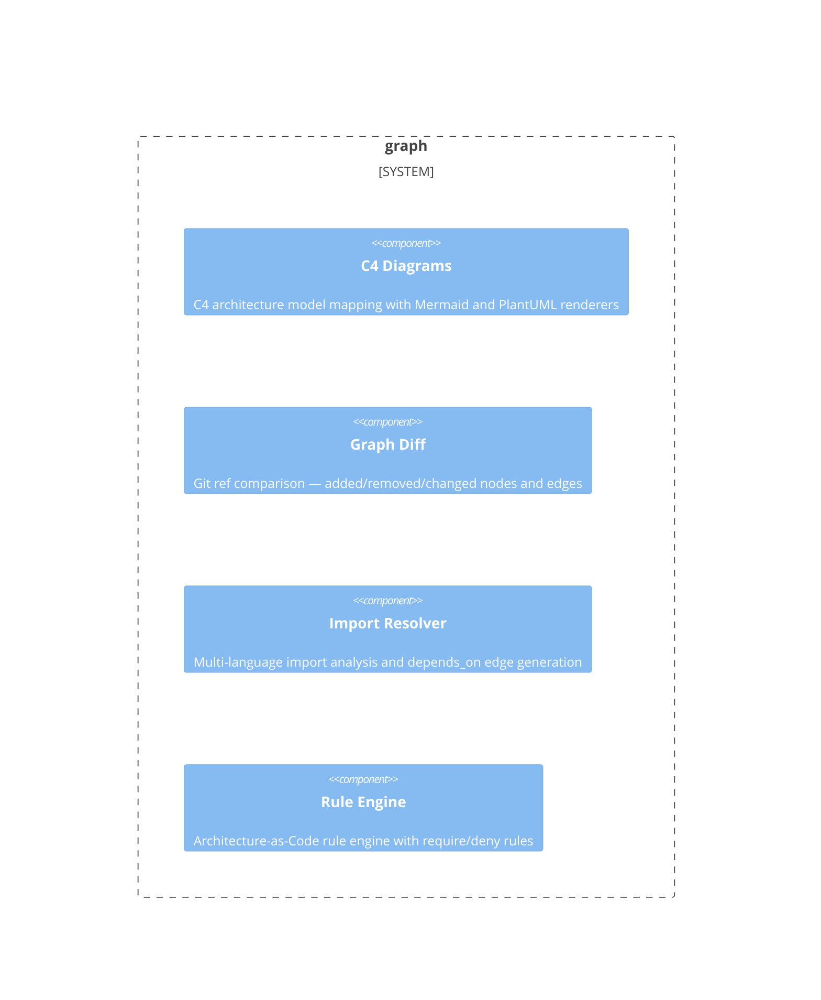

# graph

**Kind:** domain

YAML graph format, loader, diff, rule engine, import resolver, linter

**Source:** `src/beadloom/graph/`

## Public symbols

- `C4Node`
- `C4Relationship`
- `CardinalityRule`
- `Contract`
- `ContractEndpoint`
- `ContractVerdict`
- `CycleRule`
- `DenyRule`
- `EdgeChange`
- `EdgeVerdict`
- `FederatedGraph`
- `FederatedRef`
- `FederationRefError`
- `ForbidEdgeRule`
- `ForeignEdge`
- `GateFailure`
- `GraphDiff`
- `GraphLoadResult`
- `GraphParseError`
- `ImportBoundaryRule`
- `ImportInfo`
- `LayerDef`
- `LayerRule`
- `LintError`
- `LintResult`
- `NodeChange`
- `NodeMatcher`
- `ParsedFile`
- `RequireRule`
- `SnapshotDiff`
- `SnapshotInfo`
- `Violation`
- `aggregate_exports`
- `build_export`
- `classify`
- `compare_snapshots`
- `compute_diff`
- `compute_diff_from_snapshot`
- `contract_key`
- `create_import_edges`
- `cross_landscape_keys`
- `current_commit_sha`
- `diff_to_dict`
- `edge_group_key`
- `evaluate_all`
- `evaluate_cardinality_rules`
- `evaluate_cycle_rules`
- `evaluate_deny_rules`
- `evaluate_forbid_edge_rules`
- `evaluate_import_boundary_rules`
- `evaluate_layer_rules`
- `evaluate_require_rules`
- `extract_imports`
- `extract_surface`
- `filter_c4_nodes`
- `format_github`
- `format_json`
- `format_porcelain`
- `format_rich`
- `gate_failure_remediation`
- `gate_failures`
- `get_node_tags`
- `index_imports`
- `is_foreign_ref`
- `lint`
- `list_snapshots`
- `load_graph`
- `load_rules`
- `load_rules_with_tags`
- `map_to_c4`
- `parse_graph_file`
- `parse_ref`
- `reconcile_contracts`
- `render_c4_mermaid`
- `render_c4_plantuml`
- `render_diff`
- `render_federation_report`
- `resolve_import_to_node`
- `resolve_landscape`
- `resolve_repo_name`
- `save_snapshot`
- `serialize_export`
- `serialize_federation`
- `update_node_in_yaml`
- `validate_rules`

## Relationships

- **part_of**: [beadloom](../services/beadloom.md)
- **depends_on**: [context-oracle](../domains/context-oracle.md), [infrastructure](../domains/infrastructure.md)

## Documentation

- [domains/graph/README.md](/docs/domains/graph/README.md)

## Diagram

