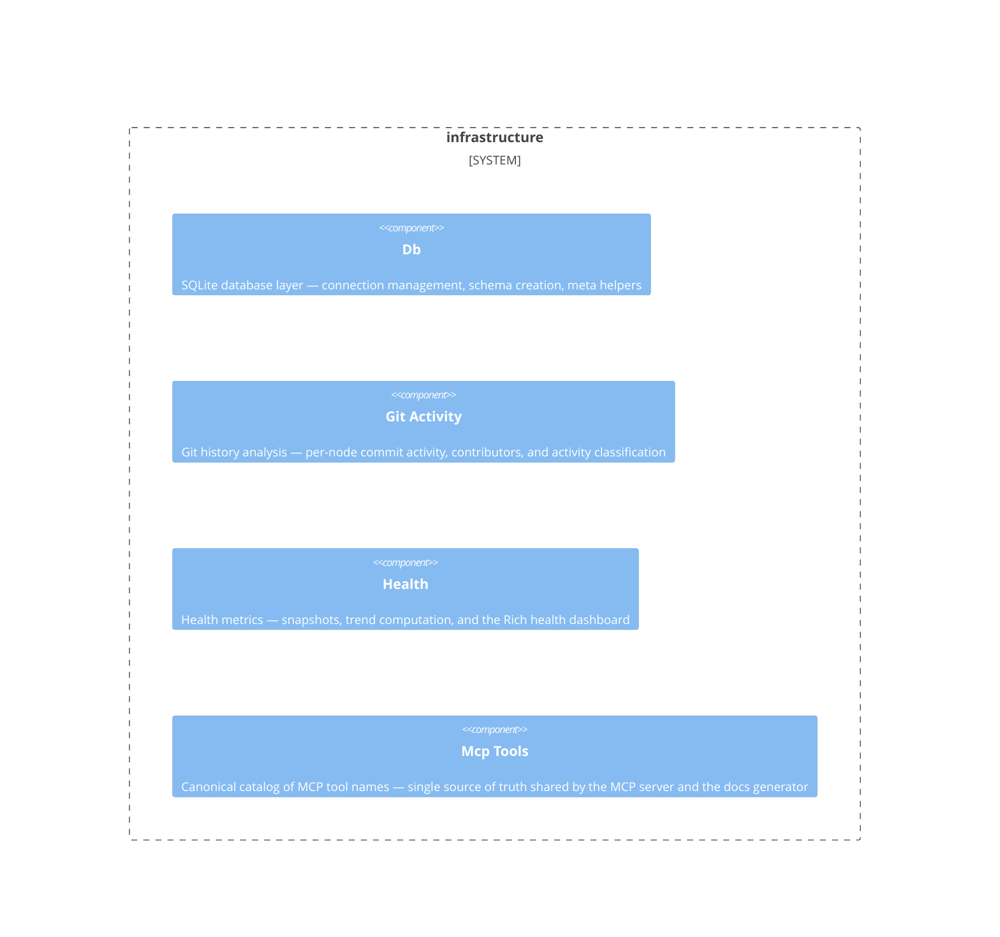

# infrastructure

**Kind:** domain

Domain-agnostic SQLite database layer, health metrics, git activity

**Source:** `src/beadloom/infrastructure/`

## Public symbols

- `GitActivity`
- `HealthSnapshot`
- `McpToolDoc`
- `analyze_git_activity`
- `compute_trend`
- `create_schema`
- `ensure_schema_migrations`
- `get_latest_snapshots`
- `get_meta`
- `mcp_tool_names`
- `open_db`
- `set_meta`
- `take_snapshot`

## Relationships

- **part_of**: [beadloom](../services/beadloom.md)
- **Used by**: [application](../domains/application.md), [beadloom](../services/beadloom.md), [cli](../services/cli.md), [context-oracle](../domains/context-oracle.md), [doc-sync](../domains/doc-sync.md), [graph](../domains/graph.md), [mcp-server](../services/mcp-server.md)
- **Parts**: [db](../other/db.md), [git-activity](../other/git-activity.md), [health](../other/health.md), [mcp-tools](../other/mcp-tools.md)

## Documentation

- [domains/infrastructure/README.md](/docs/domains/infrastructure/README.md)

## Diagram

