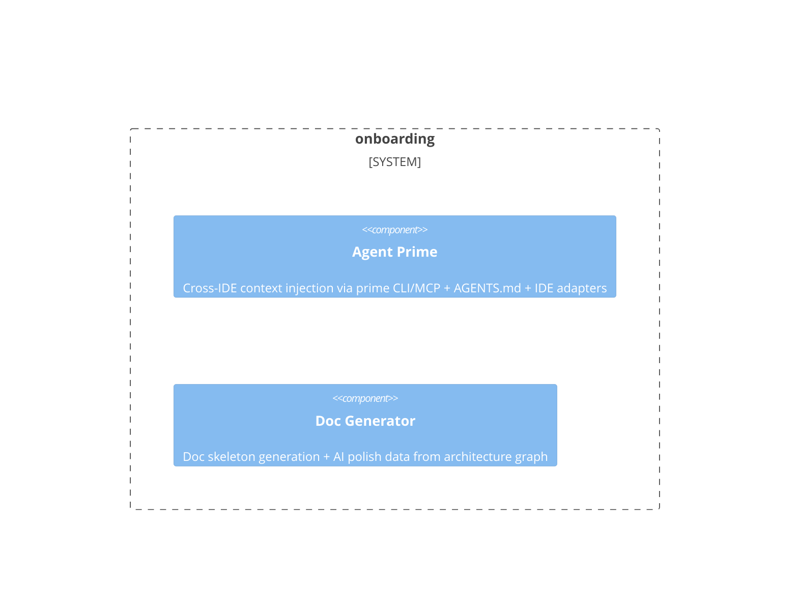

# onboarding

**Kind:** domain

Project bootstrap, doc import, architecture-aware presets, doc generation

**Source:** `src/beadloom/onboarding/`

## Public symbols

- `BranchProtectionRequest`
- `ConfigDrift`
- `GhRunner`
- `Preset`
- `PresetRule`
- `ScaffoldResult`
- `apply_branch_protection`
- `auto_link_docs`
- `bootstrap_project`
- `build_agents_md_content`
- `build_protection_payload`
- `check_config_drift`
- `classify_doc`
- `detect_preset`
- `format_polish_text`
- `generate_agents_md`
- `generate_polish_data`
- `generate_rules`
- `generate_skeletons`
- `import_docs`
- `interactive_init`
- `non_interactive_init`
- `prime_context`
- `read_deep_config`
- `refresh_agentic_flow_files`
- `refresh_claude_md`
- `scaffold`
- `scan_project`
- `setup_mcp_auto`
- `setup_rules_auto`
- `sync_agentic_flow`
- `sync_vendored_harness`
- `templates_root`
- `vendor_harness`
- `vendored_flow_root`
- `vendored_harness_root`

## Relationships

- **part_of**: [beadloom](../services/beadloom.md)
- **Used by**: [application](../domains/application.md), [cli](../services/cli.md), [mcp-server](../services/mcp-server.md)
- **Parts**: [agent-prime](../features/agent-prime.md), [doc-generator](../features/doc-generator.md)

## Documentation

- [domains/onboarding/README.md](/docs/domains/onboarding/README.md)

## Diagram

