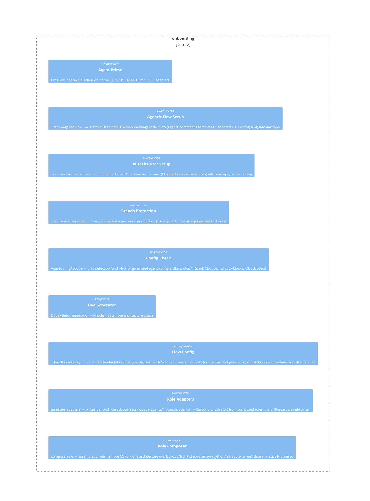

# onboarding

**Kind:** domain

Project bootstrap, doc import, architecture-aware presets, doc generation

**Source:** `src/beadloom/onboarding/`

## Public symbols

- `AdapterResult`
- `BranchProtectionRequest`
- `ConfigDrift`
- `FlowConfig`
- `FlowConfigError`
- `GhRunner`
- `Preset`
- `PresetRule`
- `ScaffoldResult`
- `apply_branch_protection`
- `auto_link_docs`
- `bootstrap_project`
- `build_agents_md_content`
- `build_flow_config`
- `build_protection_payload`
- `check_config_drift`
- `classify_doc`
- `compose_all_roles`
- `compose_role`
- `cursor_rules_body`
- `cursor_rules_relpath`
- `detect_preset`
- `detect_stack`
- `format_polish_text`
- `generate_adapters`
- `generate_agents_md`
- `generate_polish_data`
- `generate_rules`
- `generate_skeletons`
- `import_docs`
- `interactive_init`
- `load_flow_config`
- `load_flow_config_or_default`
- `non_interactive_init`
- `prime_context`
- `read_deep_config`
- `refresh_agentic_flow_files`
- `refresh_claude_md`
- `refresh_composed_adapters`
- `resolve_flow_config`
- `roles_templates_root`
- `scaffold`
- `scan_project`
- `setup_mcp_auto`
- `setup_rules_auto`
- `sync_agentic_flow`
- `templates_root`
- `vendored_flow_root`

## Relationships

- **part_of**: [beadloom](../services/beadloom.md)
- **Used by**: [application](../domains/application.md), [cli](../services/cli.md), [mcp-server](../services/mcp-server.md)
- **Parts**: [agent-prime](../features/agent-prime.md), [agentic-flow-setup](../features/agentic-flow-setup.md), [ai-techwriter-setup](../features/ai-techwriter-setup.md), [branch-protection](../features/branch-protection.md), [config-check](../features/config-check.md), [doc-generator](../features/doc-generator.md), [flow-config](../features/flow-config.md), [role-adapters](../features/role-adapters.md), [role-composer](../features/role-composer.md)

## Documentation

- [domains/onboarding/README.md](/docs/domains/onboarding/README.md)

## Diagram

