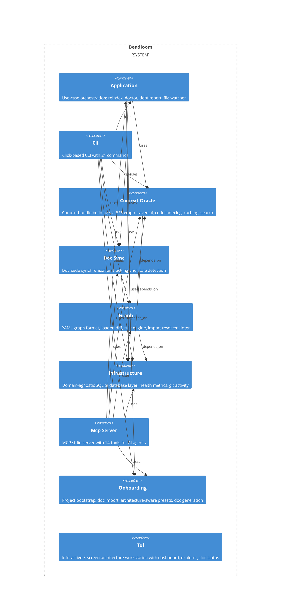

# import-resolver

**Kind:** feature

Multi-language import analysis and depends_on edge generation

**Source:** `src/beadloom/graph/import_resolver.py`

## Public symbols

- `ImportInfo`
- `create_import_edges`
- `extract_imports`
- `index_imports`
- `resolve_import_to_node`

## Relationships

- **part_of**: [graph](../domains/graph.md)

## Documentation

- [domains/graph/features/import-resolver/SPEC.md](/docs/domains/graph/features/import-resolver/SPEC.md)

## Diagram

