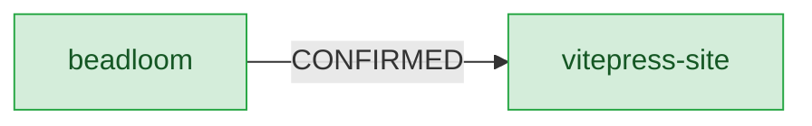

# Landscape map

Generated by `beadloom docs site` from the `federate` graph — never hand-drawn. Edges are labelled by their cross-repo `ContractVerdict`; node colour reflects health (green = healthy, red = broken, grey = external/expected). Click a service to open its page.

The single-repo landscape (one product).

