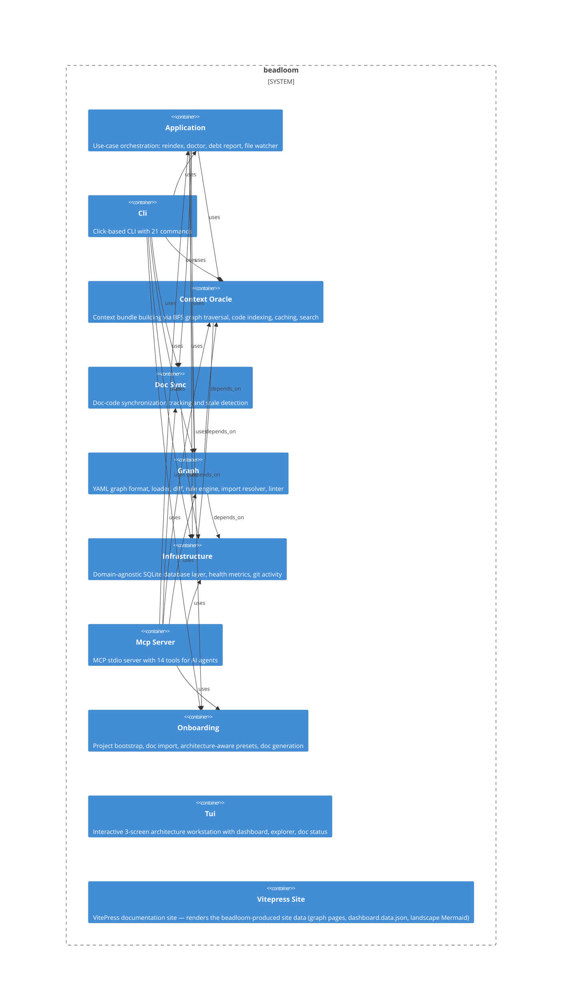

# beadloom

**Kind:** service

Beadloom CLI + MCP server — Context Oracle + Doc Sync v2 Engine (v1.5.0)

**Source:** `src/beadloom/`

## Public symbols

- `ActivityDataProvider`
- `ActivityWidget`
- `AuditFinding`
- `AuditResult`
- `BdResult`
- `BdUnavailableError`
- `BeadloomApp`
- `BranchProtectionRequest`
- `C4Node`
- `C4Relationship`
- `CacheEntry`
- `CardinalityRule`
- `CategoryScore`
- `Check`
- `ConfigDrift`
- `ContextCache`
- `ContextDataProvider`
- `ContextPreviewWidget`
- `Contract`
- `ContractEndpoint`
- `ContractVerdict`
- `CycleRule`
- `DashboardScreen`
- `DebtData`
- `DebtDataProvider`
- `DebtGaugeWidget`
- `DebtReport`
- `DebtTrend`
- `DebtWeights`
- `DenyRule`
- `DependencyPathWidget`
- `DocHealthTable`
- `DocIndexResult`
- `DocScanner`
- `DocStatusScreen`
- `DomainList`
- `EdgeChange`
- `EdgeVerdict`
- `ExplorerScreen`
- `Fact`
- `FactRegistry`
- `FederatedGraph`
- `FederatedRef`
- `FederationRefError`
- `ForbidEdgeRule`
- `ForeignEdge`
- `GateFailure`
- `GateResult`
- `GateStep`
- `GhRunner`
- `GitActivity`
- `GraphDataProvider`
- `GraphDiff`
- `GraphLoadResult`
- `GraphParseError`
- `GraphTreeWidget`
- `HealthSnapshot`
- `HelpOverlay`
- `ImpactSummary`
- `ImportBoundaryRule`
- `ImportInfo`
- `LangConfig`
- `LayerDef`
- `LayerRule`
- `LintDataProvider`
- `LintError`
- `LintPanelWidget`
- `LintResult`
- `McpToolDoc`
- `Mention`
- `MermaidIssue`
- `MermaidValidationError`
- `MetricsPoint`
- `NodeChange`
- `NodeDebt`
- `NodeDetail`
- `NodeDetailPanel`
- `NodeInfo`
- `NodeMatcher`
- `NodePage`
- `NodeRow`
- `NodeSelected`
- `ParsedFile`
- `Preset`
- `PresetRule`
- `PublishedDoc`
- `ReindexNeeded`
- `ReindexResult`
- `RequireRule`
- `Route`
- `ScaffoldResult`
- `SearchOverlay`
- `Severity`
- `SiteResult`
- `SnapshotDiff`
- `SnapshotInfo`
- `SqliteCache`
- `StatusBarWidget`
- `SyncDataProvider`
- `SyncPair`
- `TestMapping`
- `TreeNode`
- `Violation`
- `WatchEvent`
- `WhyDataProvider`
- `WhyResult`
- `aggregate_exports`
- `aggregate_parent_tests`
- `analyze_git_activity`
- `analyze_node`
- `append_metrics_point`
- `apply_branch_protection`
- `auto_link_docs`
- `backfill_structural_history`
- `bfs_subgraph`
- `bootstrap_project`
- `build_agents_md_content`
- `build_context`
- `build_dashboard_data`
- `build_export`
- `build_help_text`
- `build_landscape_data`
- `build_protection_payload`
- `build_published_docs`
- `build_sync_state`
- `check_config_drift`
- `check_doc_coverage`
- `check_parser_availability`
- `check_source_coverage`
- `check_sync`
- `check_sync_since`
- `chunk_markdown`
- `ci`
- `classify`
- `classify_doc`
- `classify_section`
- `clear_cache`
- `collect_chunks`
- `collect_debt_data`
- `compare_facts`
- `compare_snapshots`
- `compute_coverage_stats`
- `compute_debt_score`
- `compute_debt_trend`
- `compute_diff`
- `compute_diff_from_snapshot`
- `compute_doc_rows`
- `compute_etag`
- `compute_top_offenders`
- `compute_trend`
- `config_check`
- `contract_key`
- `create_import_edges`
- `create_schema`
- `create_server`
- `cross_landscape_keys`
- `ctx`
- `current_commit_sha`
- `detect_preset`
- `diff_cmd`
- `diff_to_dict`
- `docs`
- `docs_audit`
- `docs_generate`
- `docs_polish`
- `docs_site`
- `doctor`
- `edge_group_key`
- `ensure_schema_migrations`
- `estimate_tokens`
- `evaluate_all`
- `evaluate_cardinality_rules`
- `evaluate_cycle_rules`
- `evaluate_deny_rules`
- `evaluate_forbid_edge_rules`
- `evaluate_import_boundary_rules`
- `evaluate_layer_rules`
- `evaluate_require_rules`
- `existing_page_urls`
- `export`
- `extract_imports`
- `extract_routes`
- `extract_surface`
- `extract_symbols`
- `federate`
- `filter_c4_nodes`
- `format_debt_json`
- `format_debt_report`
- `format_github`
- `format_json`
- `format_polish_text`
- `format_porcelain`
- `format_rich`
- `format_routes_for_display`
- `format_top_offenders_json`
- `format_trend_section`
- `gate_failure_remediation`
- `gate_failures`
- `generate_agents_md`
- `generate_polish_data`
- `generate_rules`
- `generate_site`
- `generate_skeletons`
- `get_lang_config`
- `get_latest_snapshots`
- `get_meta`
- `get_node_tags`
- `graph`
- `handle_bead_context`
- `handle_checkpoint`
- `handle_complete_bead`
- `handle_diff`
- `handle_get_context`
- `handle_get_debt_report`
- `handle_get_graph`
- `handle_get_status`
- `handle_lint`
- `handle_list_nodes`
- `handle_mark_synced`
- `handle_search`
- `handle_sync_check`
- `handle_task_init`
- `handle_update_node`
- `handle_why`
- `has_fts5`
- `history_path`
- `human_label`
- `import_docs`
- `incremental_reindex`
- `index_docs`
- `index_imports`
- `init`
- `inject_badge`
- `install_hooks`
- `interactive_init`
- `is_foreign_ref`
- `launch`
- `link`
- `lint`
- `list_snapshots`
- `load_debt_weights`
- `load_graph`
- `load_nodes`
- `load_rules`
- `load_rules_with_tags`
- `main`
- `map_tests`
- `map_to_c4`
- `mark_synced`
- `mark_synced_by_ref`
- `mcp_serve`
- `mcp_tool_names`
- `non_interactive_init`
- `open_db`
- `parse_annotations`
- `parse_fail_condition`
- `parse_graph_file`
- `parse_ref`
- `populate_search_index`
- `prime`
- `prime_context`
- `publish_docs`
- `read_deep_config`
- `read_history`
- `reconcile_contracts`
- `refresh_agentic_flow_files`
- `refresh_claude_md`
- `reindex`
- `render_about`
- `render_all_pages`
- `render_architecture_group`
- `render_c4_mermaid`
- `render_c4_plantuml`
- `render_dashboard_md`
- `render_diff`
- `render_documentation_group`
- `render_documentation_group_from_dir`
- `render_federation_report`
- `render_landscape_md`
- `render_nav`
- `render_nav_config`
- `render_node_page`
- `render_published_doc`
- `render_sidebar`
- `render_why`
- `render_why_tree`
- `resolve_import_to_node`
- `resolve_landscape`
- `resolve_repo_name`
- `resolve_scan_paths`
- `result_to_dict`
- `run_audit`
- `run_bd`
- `run_checks`
- `run_ci_gate`
- `save_snapshot`
- `scaffold`
- `scan_project`
- `search`
- `search_fts5`
- `serialize_dashboard_data`
- `serialize_export`
- `serialize_federation`
- `set_meta`
- `setup_agentic_flow`
- `setup_ai_techwriter`
- `setup_branch_protection`
- `setup_mcp`
- `setup_mcp_auto`
- `setup_rules`
- `setup_rules_auto`
- `snapshot`
- `snapshot_compare`
- `snapshot_list`
- `snapshot_save`
- `start_file_watcher`
- `status`
- `suggest_ref_id`
- `supported_extensions`
- `sync_agentic_flow`
- `sync_check`
- `sync_update`
- `sync_vendored_harness`
- `take_snapshot`
- `templates_root`
- `tui`
- `ui`
- `update_node_in_yaml`
- `validate_mermaid`
- `validate_rules`
- `vendor_harness`
- `vendored_flow_root`
- `vendored_harness_root`
- `watch`
- `watch_cmd`
- `why`

## Relationships

- **depends_on**: [application](../domains/application.md), [context-oracle](../domains/context-oracle.md), [doc-sync](../domains/doc-sync.md), [graph](../domains/graph.md), [infrastructure](../domains/infrastructure.md)
- **Parts**: [application](../domains/application.md), [cli](../services/cli.md), [context-oracle](../domains/context-oracle.md), [doc-sync](../domains/doc-sync.md), [graph](../domains/graph.md), [infrastructure](../domains/infrastructure.md), [mcp-server](../services/mcp-server.md), [onboarding](../domains/onboarding.md), [tui](../services/tui.md), [vitepress-site](../other/vitepress-site.md)

## Documentation

- [architecture.md](/docs/architecture.md)
- [getting-started.md](/docs/getting-started.md)
- [guides/ci-setup.md](/docs/guides/ci-setup.md)

## Diagram

