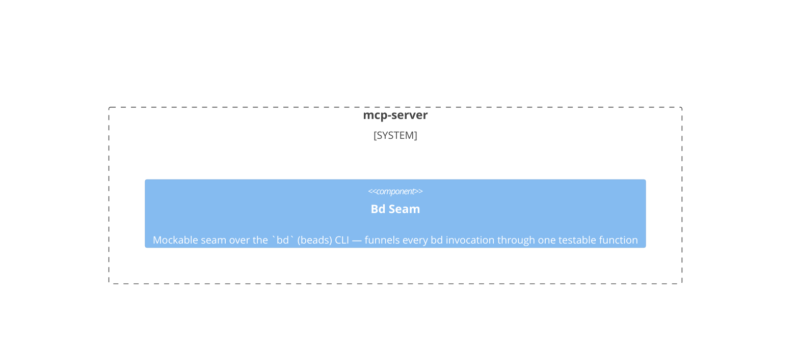

# mcp-server

**Kind:** service

MCP stdio server with 14 tools for AI agents

**Source:** `src/beadloom/services/mcp_server.py`

## Public symbols

- `create_server`
- `handle_bead_context`
- `handle_checkpoint`
- `handle_complete_bead`
- `handle_diff`
- `handle_get_context`
- `handle_get_debt_report`
- `handle_get_graph`
- `handle_get_status`
- `handle_lint`
- `handle_list_nodes`
- `handle_mark_synced`
- `handle_search`
- `handle_sync_check`
- `handle_task_init`
- `handle_update_node`
- `handle_why`

## Relationships

- **part_of**: [beadloom](../services/beadloom.md)
- **uses**: [application](../domains/application.md), [context-oracle](../domains/context-oracle.md), [doc-sync](../domains/doc-sync.md), [graph](../domains/graph.md), [infrastructure](../domains/infrastructure.md), [onboarding](../domains/onboarding.md)
- **Parts**: [bd-seam](../other/bd-seam.md)

## Documentation

- [services/mcp.md](/docs/services/mcp.md)

## Diagram

